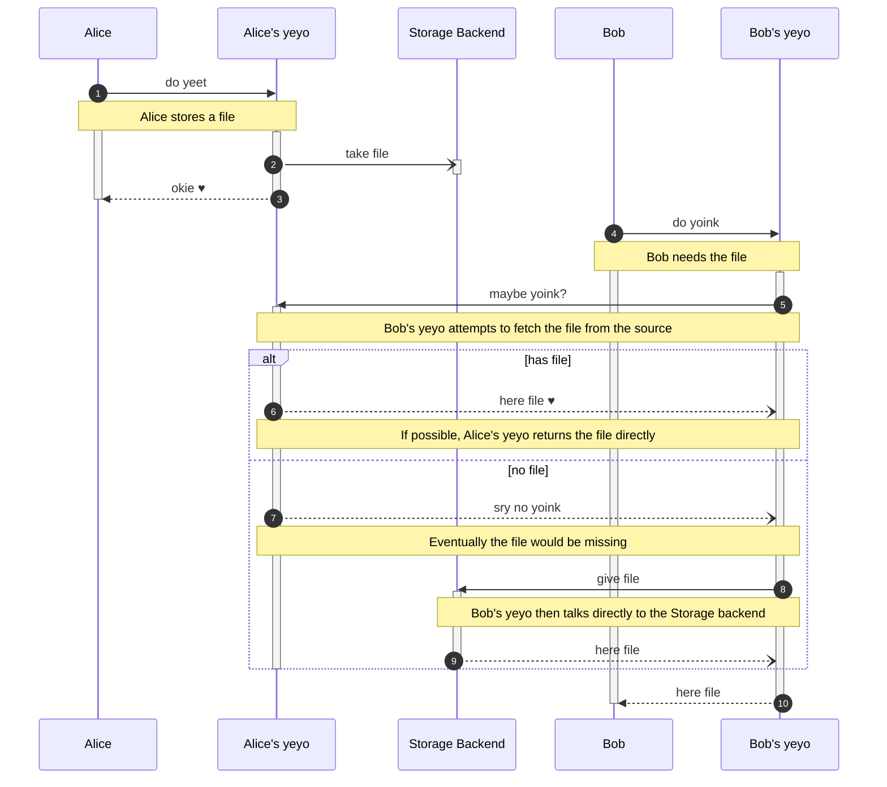

# yeet/yoink — A file storage and retrieval service

[](https://github.com/sunsided/yeet-yoink)
[](https://github.com/sunsided/yeet-yoink/releases)
[](https://github.com/sunsided/yeet-yoink/blob/main/LICENSE.md)
[](https://github.com/sunsided/yeet-yoink)
[](https://github.com/sunsided/yeet-yoink/actions/workflows/rust.yml)
[](https://github.com/sunsided/yeet-yoink/issues)
[](https://libraries.io/github/sunsided/yeet-yoink)
[](https://github.com/sunsided/yeet-yoink)

A service to which you can yeet your files in order to yoink them from somewhere else.
This is meant to simplify cluster-local file sharing with configurable persistence backends.

One key aspect here is that a service like this can offload communication with object storage,
databases or other systems, allowing the actual storage and retrieval within the application
to be reduced to a simple HTTP POST and GET, given a file ID.

> ⚠️ **This service is work in progress.**



## HTTP API

### Storing Files

* `/yeet` - Hands a file over to the service for storage and returns its ID.
  * `?file_name=...` - Optional. Allows to specify name metadata for the file.

### Retrieving files

* `/yoink/:id` - Retrieves a file from storage, given its ID.

### Metrics

* `/metrics` - Produces metrics in Prometheus/OpenMetrics format.

### Health Checks

* `/startupz` - Meant for Kubernetes startup probes. 
* `/readyz` - Meant for Kubernetes readiness probes. 
* `/livez` - Meant for Kubernetes liveness probes. 
* `/health` - Meant for complete health checks (e.g. by Google Cloud Load Balancer). 
* `/healthz` - Meant for human inspection.

### Shutdown

* `/stop` - Initiates a graceful shutdown.

## Example run

```shell
cargo run --bin yeet-yoink -- --http 127.0.0.1:8080 --http 127.0.1.1:8081 -c example-config.yaml
```
